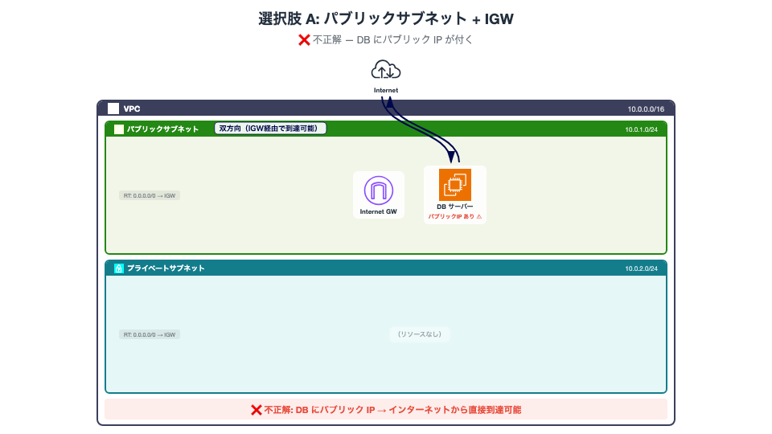
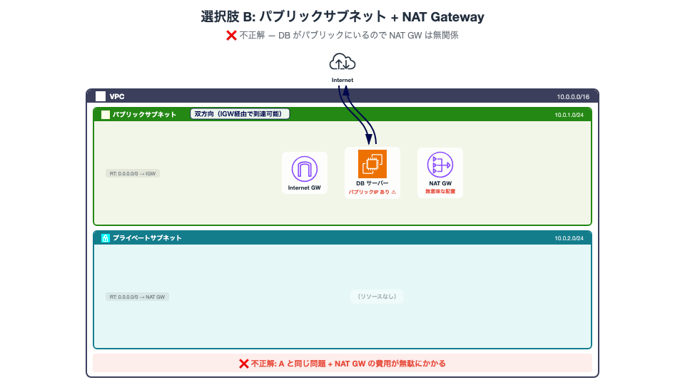
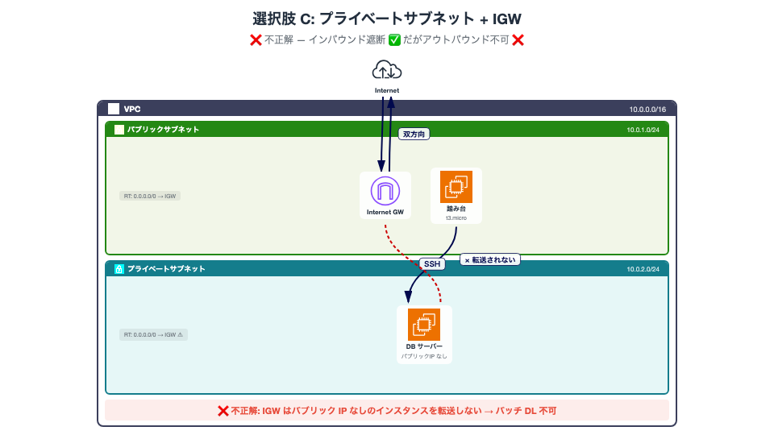
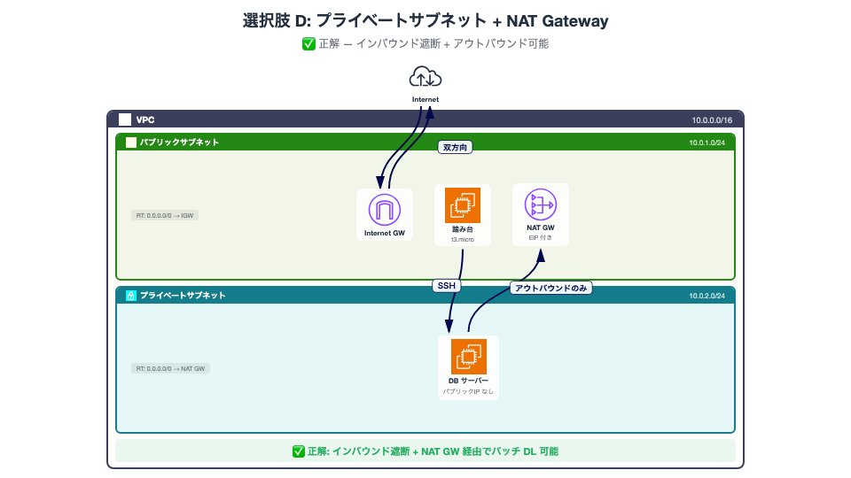

<!-- _class: title -->

# DBサーバーを守るネットワーク設計

Terraform ハンズオン

---

## 今日やること

SAA の問題を **Terraform で全選択肢を構築** して、正解・不正解を **自分の手で検証** する

---

## 今日のゴール

**「なぜその構成が正解なのか」を体で理解する**

暗記ではなく、実体験で定着させる

---

<!-- _class: section -->

# 前提知識

---

## VPC とは

**Virtual Private Cloud** — AWS 上に作る自分だけのネットワーク空間

CIDR ブロック（例: `10.0.0.0/16`）でアドレス範囲を定義する

---

## サブネットとは

VPC の中をさらに区切ったネットワーク

| 種類 | 特徴 |
|------|------|
| パブリック | インターネットと直接通信できる |
| プライベート | インターネットから隔離されている |

---

## Internet Gateway（IGW）

VPC とインターネットをつなぐ **双方向の出入口**

- アウトバウンド: プライベートIP → パブリックIP に NAT して送信
- インバウンド: パブリックIP → プライベートIP に NAT して受信

**重要: パブリックIPを持たないインスタンスのトラフィックは転送しない**

---

## NAT Gateway

プライベートサブネットから **外向き通信だけ** を許可する仕組み

- アウトバウンド: プライベートIP → NAT GW の EIP で送信 ✅
- インバウンド: 外部からの新規接続は **転送しない** ❌

一方通行のドア

---

## IGW vs NAT Gateway まとめ

|  | IGW | NAT GW |
|--|-----|--------|
| 方向 | 双方向 | アウトバウンドのみ |
| 必要なもの | パブリック IP | 不要（NAT GW が持つ） |
| コスト | 無料 | 〜$0.062/h + データ転送料 |
| 用途 | Web サーバー等 | DB のパッチ DL 等 |

---

## パブリックサブネットとは

ルートテーブルに **IGW へのルート** があるサブネット。これだけ

> *"If a subnet is associated with a route table that has a route to an internet gateway, it's known as a public subnet."*

インスタンスがインターネットと **双方向通信** するには、さらにパブリック IP（または EIP）が必要

<span style="font-size: 8px;">https://docs.aws.amazon.com/vpc/latest/userguide/VPC_Internet_Gateway.html</span>

---

<!-- _class: section -->

# 問題

---

<!-- _class: exam -->

<div class="exam-header">☐　問題:</div>

<div class="exam-body">
あなたはソリューションアーキテクトとして、AWSを活用してEC2インスタンス上にデータベースサーバーを設置する役割を担っています。このデータベースは非常に重要な情報を保存するため、必要なパッチをダウンロードする際を除き、このデータベースサーバーはインターネットから接続されないようにする必要があります。
</div>

<div class="exam-question">この要件を満たすためのAWSネットワーク設定はどれですか。</div>

<div class="exam-options">
<div class="exam-option">○　データベースをパブリックサブネット内に構築して、このプライベートサブネットのルートテーブルにインターネットゲートウェイへのルートを設定する。</div>
<div class="exam-option">○　データベースをパブリックサブネット内に構築して、このプライベートサブネットのルートテーブルにNATゲートウェイへのルートを設定する。</div>
<div class="exam-option">○　データベースをプライベートサブネット内に構築して、このプライベートサブネットのルートテーブルにインターネットゲートウェイへのルートを設定する。</div>
<div class="exam-option">○　データベースをプライベートサブネット内に構築して、このプライベートサブネットのルートテーブルにNATゲートウェイへのルートを設定する。</div>
</div>

---

<!-- _class: section -->

# ハンズオン

---

## 環境準備

```bash
git clone <リポジトリURL>
cd db-network-design
```

4つのディレクトリがあります

```
option-a/   # パブリック + IGW
option-b/   # パブリック + NAT
option-c/   # プライベート + IGW
option-d/   # プライベート + NAT
```

---

## 進め方

```bash
cd option-a
terraform init
terraform apply -auto-approve
```

output に表示される IP を使って **3つの検証** を行う

終わったら `terraform destroy -auto-approve` で片付け

---

<!-- _class: section -->

# 選択肢 A を検証する

パブリックサブネット + IGW

---

## A: 構成図



---

## A: 構築して確認

```bash
cd option-a
terraform init && terraform apply -auto-approve
```

output を確認 → **パブリック IP が表示される**

---

## A: 検証してみよう

```bash
# パブリックIPの確認
terraform output db_public_ip
# → IPが表示される = インターネットから到達可能

# 外部からポートスキャン
nmap -Pn -p 3306 <DB_PUBLIC_IP>
```

**パブリックIPがある = インターネットからルーティング可能**

---

## A: 判定

❌ **不正解**

DB にパブリック IP が付いている時点でアウト

SG でブロックしていても、設定ミス1つでインターネットに露出する。**構造的に** インバウンド遮断できていない

```bash
terraform destroy -auto-approve
```

---

<!-- _class: section -->

# 選択肢 B を検証する

パブリックサブネット + NAT

---

## B: 構成図



---

## B: 検証してみよう

```bash
cd option-b
terraform init && terraform apply -auto-approve
terraform output db_public_ip
# → またパブリックIPが表示される
```

NAT GW はプライベートサブネット用に設定されているが、**DB はパブリックサブネットにいるので全く無関係**

---

## B: 判定

❌ **不正解**

選択肢 A と同じ問題 + NAT GW の費用が無駄にかかる

**DB がどのサブネットにいるか** が最重要

```bash
terraform destroy -auto-approve
```

---

<!-- _class: section -->

# 選択肢 C を検証する

プライベートサブネット + IGW

---

## C: 構成図



---

## C: 検証してみよう

```bash
cd option-c
terraform init && terraform apply -auto-approve

# パブリックIPの確認
terraform output db_public_ip
# → 空！ インターネットからアクセスできない ✅

# 踏み台経由でDBにSSH
ssh -J ec2-user@<BASTION_IP> ec2-user@<DB_PRIVATE_IP>

# DB上でインターネットアクセスを試行
curl -m 10 https://example.com
# → タイムアウト ❌
```

---

## C: なぜ curl が失敗するのか

IGW の動作を思い出そう

> パブリックIPを持たないインスタンスのトラフィックは転送しない

DB はプライベートサブネットにいるのでパブリック IP がない。IGW は NAT 変換する先の IP がなく、**パケットが破棄される**

---

## C: 判定

❌ **不正解**

- インバウンド遮断 ✅（パブリックIPなし）
- アウトバウンド ❌（IGW ではプライベートIPのみの通信を転送できない）

**あと一歩！ルートの向き先を変えれば…**

```bash
terraform destroy -auto-approve
```

---

<!-- _class: section -->

# 選択肢 D を検証する

プライベートサブネット + NAT

---

## D: 構成図



---

## D: 検証してみよう

```bash
cd option-d
terraform init && terraform apply -auto-approve

# パブリックIPの確認
terraform output db_public_ip
# → 空！ ✅

# 踏み台経由でDBにSSH
ssh -J ec2-user@<BASTION_IP> ec2-user@<DB_PRIVATE_IP>

# DB上でインターネットアクセスを試行
curl -m 10 https://example.com
# → 成功！ ✅
```

---

## D: 送信元IPを確認してみよう

```bash
# DB上で実行
curl -m 10 https://checkip.amazonaws.com
# → NAT GW の EIP が表示される
```

DB のプライベート IP ではなく **NAT GW の IP** で外に出ている。外部から見ると DB の存在がわからない

---

## D: 外部からの接続も試そう

```bash
# ローカルPCから NAT GW の IP に対して
nmap -Pn -p 3306 <NAT_GW_IP>
# → closed（NAT GWはインバウンドを転送しない）
```

NAT GW は **ステートフル** = 既存セッションの戻りパケットのみ許可。外部からの新規接続は全てブロック

---

## D: 判定

✅ **正解！**

- インバウンド遮断 ✅（パブリックIPなし）
- アウトバウンド ✅（NAT GW 経由でパッチ DL 可能）

**両方の要件を満たす唯一の構成**

```bash
terraform destroy -auto-approve
```

---

<!-- _class: section -->

# コストの話

---

## 今日使ったリソースの料金

| リソース | 料金 | 注意 |
|---------|------|------|
| VPC / サブネット / IGW | **無料** | いくら作ってもタダ |
| EC2 (t3.micro) | ~$0.0136/h | 停止すれば課金停止 |
| EIP（未使用時） | ~$0.005/h | EC2 に紐づけていれば無料 |
| **NAT Gateway** | **~$0.062/h** | **停止できない。消すしかない** |

---

## NAT Gateway の落とし穴

**起動している限り課金が止まらない**（月額 ~$45）

EC2 は停止できるが、NAT GW には「停止」がない。使わないなら **destroy するしかない**

ハンズオン後は必ず `terraform destroy` すること

---

## ハンズオン後の片付けチェックリスト

```bash
# 各ディレクトリで destroy
cd option-d && terraform destroy -auto-approve

# AWS コンソールでも確認（消し忘れ防止）
# VPC → NAT ゲートウェイ → 0件であることを確認
# EC2 → インスタンス → 0件であることを確認
# VPC → Elastic IP → 0件であることを確認
```

**Terraform の state ファイルを消してしまうと destroy できなくなる**ので注意

---

## 実務でのコスト最適化 Tips

NAT GW が高い場合の代替手段

| 方法 | コスト | 用途 |
|------|--------|------|
| NAT Gateway | ~$45/月 + 転送料 | 本番環境のスタンダード |
| NAT Instance (t3.nano) | ~$4/月 | 開発環境・検証用 |
| VPC Endpoint | ~$10/月 | S3/DynamoDB 等の特定サービスのみ |
| パブリックサブネット配置 | 無料 | セキュリティ要件が緩い場合のみ |

---

<!-- _class: section -->

# まとめ

---

## 全選択肢の比較

| | インバウンド遮断 | アウトバウンド | 判定 |
|---|:---:|:---:|:---:|
| A: パブリック + IGW | ❌ パブリックIP付く | ✅ | ❌ |
| B: パブリック + NAT | ❌ パブリックIP付く | ✅ | ❌ |
| C: プライベート + IGW | ✅ | ❌ IGWが転送しない | ❌ |
| D: プライベート + NAT | ✅ | ✅ NAT GW経由 | ✅ |

---

## 覚えるべき3つのこと

**1. パブリックサブネット = IGW へのルートがあるサブネット**

**2. IGW はパブリックIPを持たないインスタンスを無視する**

**3. NAT GW は「外向き通信だけ許可」を実現する仕組み**

---

## 実務での応用

この「プライベートサブネット + NAT GW」パターンは AWS で最も基本的なセキュアアーキテクチャ

- RDS / ElastiCache / 内部 API サーバー
- Lambda（VPC 内実行時）
- ECS タスク（プライベートサブネット配置）

全て同じ考え方

---

<!-- _class: title -->

# おつかれさまでした

質問があればどうぞ
